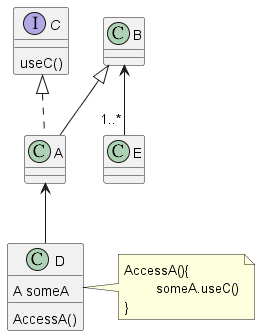
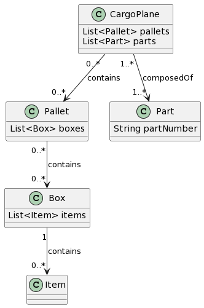
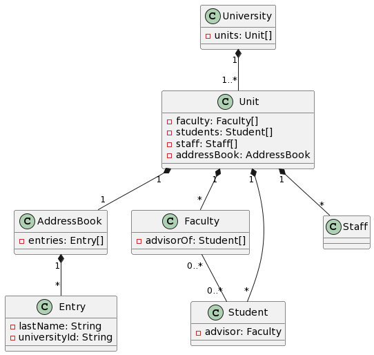

# 作業二


## Question 1

### (a)
A is a subclass of B. A implements an interface C which is used by D to access A. B is associated with one or more Es.



### (b)
A CargoPlane aggregates zero or more Pallets. Each Pallet aggregates zero or more Boxes. A CargoPlane is composed of one or more Parts. Each Box contain one or more Items that are accessed by part numbers.



### (c)
A University is composed of one or more Units, such as Colleges and Schools. Each Unit contains Faculty, Students, and Staff. A Unit maintains an AddressBook filled with Entries, and one Entry for each type of Person contained in that Unit. An Entry can be located in the AddressBook by supplying their last
Name or their UniversityId. Faculty members can be the adviser of zero or more Students.



## Question 2

This would break abstraction and seriously degrade the code maintainability. Once developer wants to use getArea() with all shapes, it can't work correctly with Square, and Shape is no longer obey polymorphism.

## Question 3

### (a)

```python
class Animal:
    def __init__(self, name):
        self.name = name
    def sleep(self):
        print(f"{self.name} is sleeping.")
    def play(self):
        print(f"{self.name} is playing.")
    def takeForWalk(self):
        print(f"{self.name} is being taken for a walk.")
    def makeNoise():
        print("aaa")
class Pachyderm(Animal):
    def roam():
        print("roam")
class Feline(Animal):
    def roam():
        print("roam")
class Canine(Animal):
    def roam():
        print("roam")

class Rhino(Pachyderm):
    pass        
class Hippo(Pachyderm):
    pass
class Elephant(Pachyderm):
    pass

class Cat(Feline):
    pass
class Tiger(Feline):
    pass
class Lion(Feline):
    pass
class Dog(Canine):
    pass
class Wolf(Canine):
    pass


dog = Dog("brave")
dog.play()
dog.takeForWalk()

cat = Cat("mimi")
cat.play()
cat.takeForWalk()
```
```bash
python3 hw3.a.py
```


### (b)
