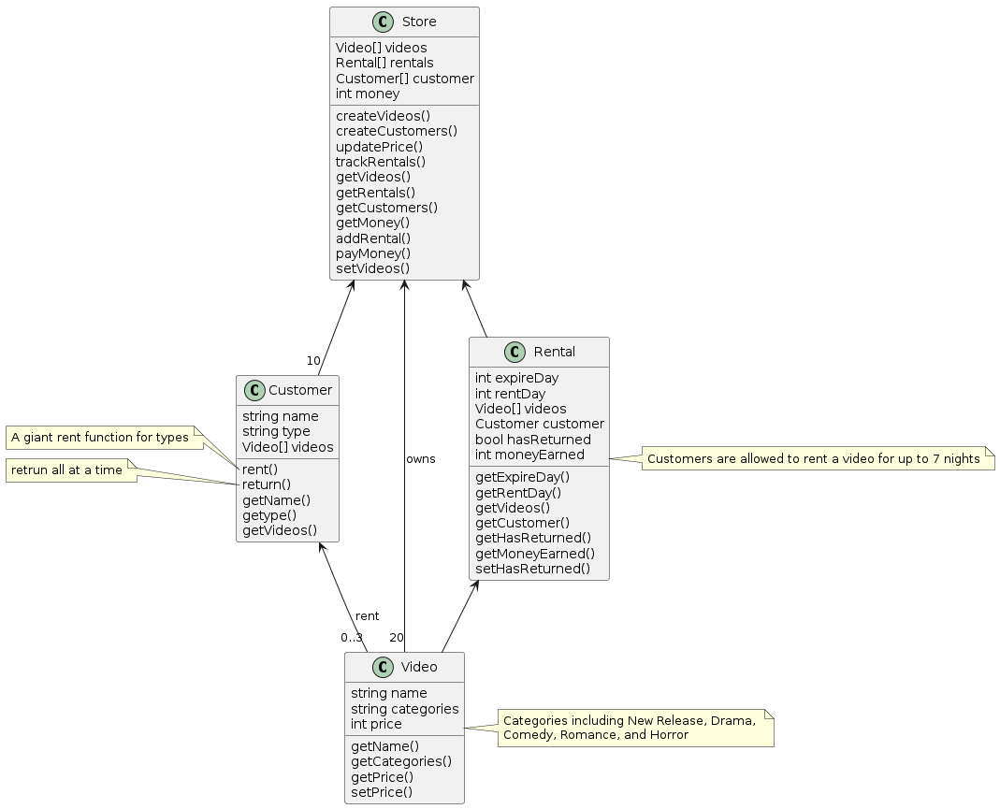

# 作業三

## Question 1

### main.ts
```typescript
import { CUSTOMER_TYPES, Customer } from "./Customer"
import { Store } from "./Store"
import { randomInt } from "./helpers"

const store = new Store()

console.log(store.videos)
console.log(store.customer)

for (let day = 1; day <= 35; day++) {
	store.trackRentals(day)
	if (store.videos.size === 0) continue
	const visitableCustomers: Customer[] = store.customer.filter((customer) => {
		if (store.videos.size < 3 && customer.type === CUSTOMER_TYPES[1])
			return false
		return true
	})
	if (visitableCustomers.length === 0) continue
	const customerToday =
		visitableCustomers[randomInt(0, visitableCustomers.length - 1)]
	customerToday.rent(store, day)
}
```
### Video.ts
```typescript
export const VIDEO_CATEGORIES = [
	"New Release",
	"Drama",
	"Comedy",
	"Romance",
	"Horror",
]

export class Video {
	name: string
	categories: string
	price: number = 0
	constructor(name: string, categories: string) {
		this.name = name
		this.categories = categories
	}
}

```

### Store.ts
```typescript
import { CUSTOMER_TYPES, Customer } from "./Customer"
import { Rental } from "./Rental"
import { VIDEO_CATEGORIES, Video } from "./Video"
import { randomInt } from "./helpers"

export class Store {
	videos: Set<Video> = new Set()
	rentals: Rental[] = []
	customer: Customer[] = []
	money: Number = 0

	constructor() {
		this.createVideos()
		this.createCustomers()
		this.updatePrice()
	}

	createVideos() {
		for (let i = 0; i < 20; i++) {
			const currentVideo = new Video(
				`Video${i + 1}`,
				VIDEO_CATEGORIES[randomInt(0, 4)]
			)
			this.videos.add(currentVideo)
		}
	}

	createCustomers() {
		for (let i = 0; i < 10; i++) {
			const currentCustomer = new Customer(
				`Customer${i + 1}`,
				CUSTOMER_TYPES[randomInt(0, 2)]
			)
			this.customer.push(currentCustomer)
		}
	}

	updatePrice() {
		const mapCategoriesToPrice = new Map(
			VIDEO_CATEGORIES.map((category) => [category, randomInt(1, 10)])
		)
		const newVideoSet: Set<Video> = new Set()
		this.videos.forEach((video) => {
			video.price =
				mapCategoriesToPrice.get(video.categories) ||
				(0 && console.error("Some thing go wrong with video categories!"))
			newVideoSet.add(video)
		})
		this.videos = newVideoSet
	}

	trackRentals(day: Number) {
		this.rentals.forEach((rental) => {
			if (rental.hasReturned === true) return
			if (rental.expireDay === day) {
				rental.customer.return(this)
				rental.hasReturned = true
			}
		})
	}
}

```

### Rental.ts
```typescript
import { Customer } from "./Customer"
import { Video } from "./Video"

export class Rental {
	expireDay: number
	videos: Video[] = []
	customer: Customer
	hasReturned: Boolean = false
	constructor(expireDay: number, videos: Video[], customer: Customer) {
		this.expireDay = expireDay
		this.videos = videos
		this.customer = customer
	}
}

```

### Customer.ts
```typescript

```

### helpers.ts
```typescript
export function randomInt(floor: number, ceil: number): number {
	return Math.ceil(Math.random() * (ceil - floor + 1)) + floor - 1
}

```

## Question 2

### 1.UML class diagram


### 2.程式編譯與運行方法
```bash

```

### 3.程式說明
